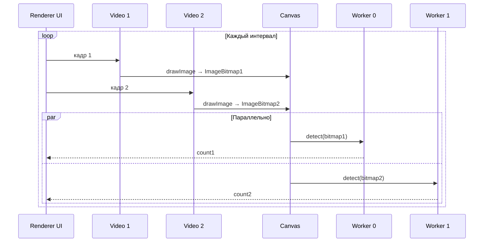
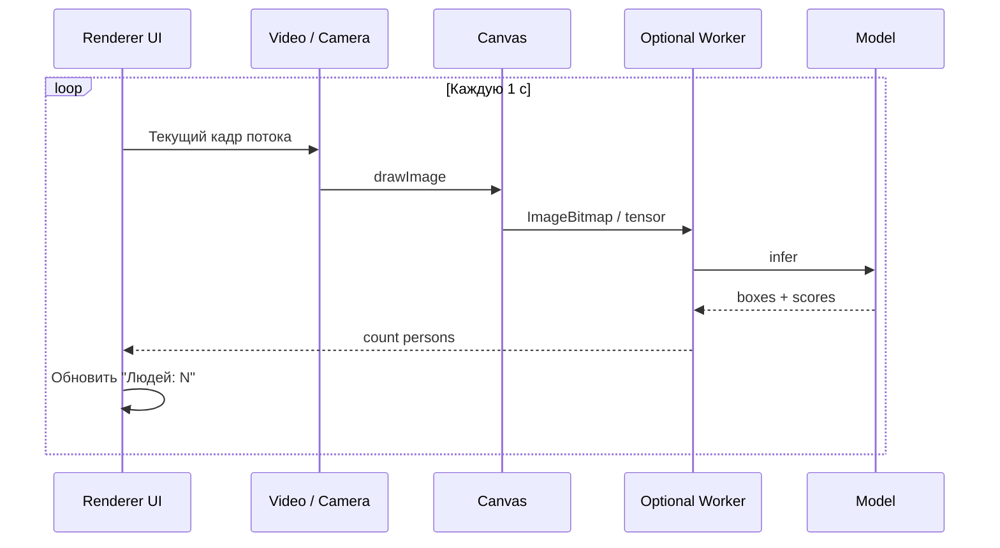

---
tags:
  - architecture
---

# Архитектура: бэкенд и фронтенд

Связано: [[Индекс]], [[Библиотеки и зависимости]], [[Сборка Windows exe]].

В Electron термины **«бэкенд»** и **«фронтенд»** ложатся на процессы так:

| Условное название | Процесс Electron | Ответственность |
|-------------------|------------------|-----------------|
| **Фронтенд** | **Renderer** (1+ окон) | UI, превью видео, выбор устройства, таймер 1 Гц, отрисовка счётчика, по желанию — Web Worker для инференса |
| **Бэкенд** | **Main** | Жизненный цикл приложения, создание окон, **политики безопасности**, нативные диалоги, опционально тяжёлый инференс (`onnxruntime-node`), IPC-маршрутизация |
| **Preload** | Изолированный скрипт | Узкий **contextBridge** API для безопасного вызова main из UI |

## Поток данных (пайплайн кадра)

Режим **две камеры** (дополнение к одному `<video>` для файла/потока):

1. **Источник:** `MediaStream` (камера; при **двух** камерах — **два** `getUserMedia` и два элемента `<video>`) или один `<video>` (файл / HTTP-трансляция).
2. **Сэмплинг:** `setInterval` / `requestVideoFrameCallback` **не обязателен** — достаточно таймера **1000 ms** (или заданного интервала) и `drawImage` **для каждого активного видеоисточника** в рамках одного тика: сначала кадр с первой камеры, затем со второй.
3. **Инференс:** из Canvas получить данные (два `ImageBitmap` с двух `<video>`, если обе камеры выбраны), нормализовать, выполнить модель. **Две камеры:** в коде используются **два** Web Worker с **двумя** копиями модели (COCO/YOLO) — `detect` по кадру 1 и по кадру 2 запускаются **параллельно** (`Promise.allSettled` на рендерере). Один поток (файл, URL, одна камера) — воркер один (слот 0).
4. **UI:** отобразить **два** числа в режиме «две камеры» или **одно** — для файла/потока; опционально — боксы на overlay-canvas.

## Разделение «бэкенд» логики

### Минимальный MVP (всё в Renderer)

- Камера и файл остаются в UI-слое.
- Модель (TF.js / onnxruntime-web) в **том же контексте** или в **Dedicated Worker** (чтобы не подвисал интерфейс).

**Плюсы:** меньше IPC, проще отладка.  
**Минусы:** main не участвует в ML; ограничения WASM/WebGL.

### Расширенный вариант (часть в Main)

- В main: **worker_threads** + `onnxruntime-node`, загрузка модели один раз.
- Renderer шлёт через IPC **сжатый кадр** (JPEG) или **тензор** — но передача больших буферов дороже; чаще выгоднее инференс в renderer/worker.

**Когда имеет смысл main:** единая точка для нескольких окон, политики файлов, интеграция с нативными DLL.

## Безопасность Electron (обязательно учесть в реализации)

- `contextIsolation: true`, `nodeIntegration: false` в рендерере.
- Белый список в **Content Security Policy** для продакшена.
- Разрешения на **микрофон/камеру** в `session.setPermissionRequestHandler` при необходимости.

## Модули кода (логические)

| Модуль | Содержание |
|--------|------------|
| `main` | bootstrap, окно, preload path |
| `preload` | `api.getVideoSources()`, `api.openFileDialog()` |
| `renderer/pages` | экран выбора источника, превью (два `<video>` только в режиме «камера») |
| `renderer/pipeline` | `drawVideoFrame`, `scheduleEvery(interval)`; при двух камерах — два `drawImage` + две детекции за тик |
| `renderer/detector` | адаптер под выбранный движок (coco-ssd / onnx) |
| `shared/types` | DTO для IPC; в настройках: `cameraDeviceId`, `cameraDeviceId2` для пары устройств |

## Связь с требованиями

Сценарии из [[Требования и сценарии]] закрываются тем, что **один и тот же** путь `Canvas` используется и для `video` элемента (файл), и для кадра с `HTMLVideoElement` с `srcObject` (камера).
