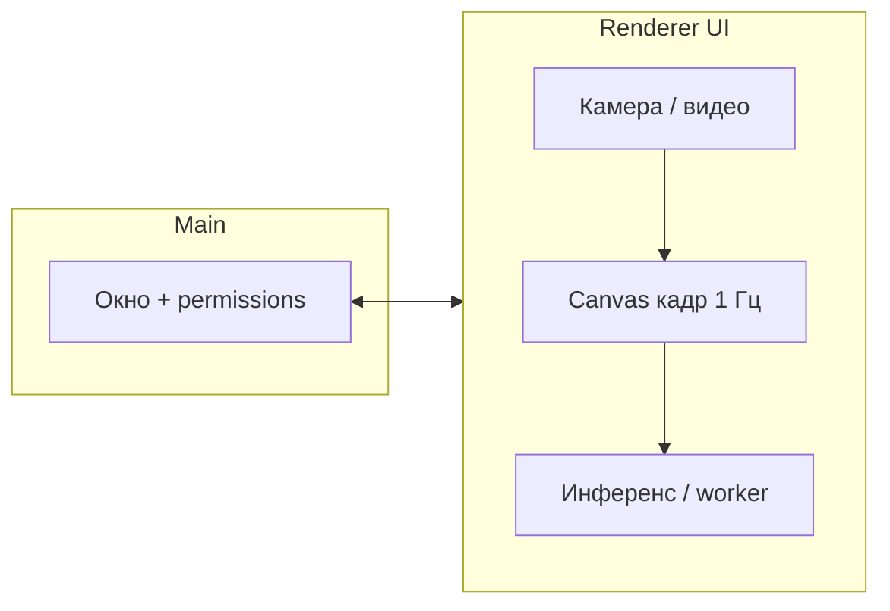

---
tags:
  - viewPeople
  - index
---

# ViewPeople — документация

Десктопное приложение для **Windows (.exe)** на базе [[Electron]], которое:

- берёт кадр с **двух выбранных камер одновременно** (счёт по каждой отдельно) или **тестового видеофайла** (один поток) / **трансляции**;
- **раз в секунду** анализирует кадр и выводит **число людей** в кадре (сценарий в духе уличной камеры).

## Навигация

| Заметка | Содержание |
|---------|------------|
| [[Требования и сценарии]] | Цели, ограничения, UX |
| [[Библиотеки и зависимости]] | Стек, варианты детекции, плюсы/минусы |
| [[Архитектура бэкенд и фронтенд]] | Main / Renderer / IPC, пайплайн кадра |
| [[Сборка Windows exe]] | Упаковка, нативные модули, подпись |
| [[План разработки]] | Этапы, критерии готовности, приоритеты |

## Сборка одной командой

В корне репозитория: **`npm run build:win`** — собирает main/preload/renderer и сразу упаковывает установщик Windows (см. [[Сборка Windows exe]]). В CI тот же сценарий + артефакт установщика.

## Краткий стек (рекомендация)

- **Оболочка:** Electron + TypeScript + **electron-vite** (единая сборка процессов).
- **Видео:** Web APIs в рендерере (`getUserMedia`, `<video>` + Canvas для файла).
- **Детекция людей:** модель **детекции объектов** с классом `person` — например **COCO-SSD в TensorFlow.js** (простой старт) или **YOLO + ONNX Runtime** (точнее/быстрее на CPU при правильной модели).

---

*Vault оформлен под Obsidian: используйте граф и `[[wikilinks]]` для переходов.*
