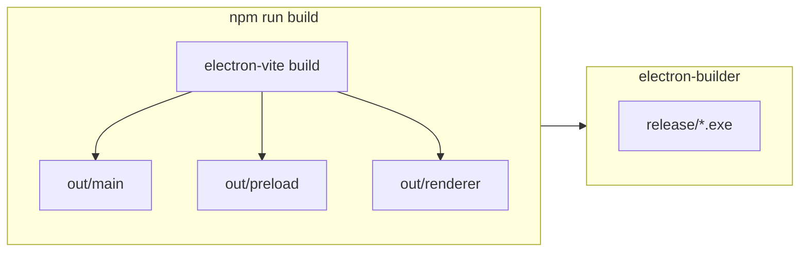

---
tags:
  - build
  - windows
---

# Сборка Windows (.exe)

Связано: [[Индекс]], [[Архитектура бэкенд и фронтенд]].

## Цель

Получить установщик или portable **`.exe`** для Windows x64 (и при необходимости отдельную конфигурацию ARM64).

## Скрипты в репозитории (ViewPeople)

Одна команда собирает **всё**, что нужно Electron-приложению:

| Скрипт | Что делает |
|--------|------------|
| `npm run build` | **Main + preload + renderer** одним проходом (**electron-vite build**) — это и есть «бэкенд» (Node-процессы) и «фронтенд» (бандл UI в `out/renderer`). |
| `npm run setup:assets` | Качает **`yolov8n.onnx`** в `resources/models/` (нужен интернет **на машине сборки**). Повторно — пропуск, если файл уже есть. По умолчанию используются зеркала (Hugging Face); свой URL можно задать переменной **`YOLO_ONNX_URL`**. |
| `npm run build:win` | **`setup:assets`** → **`build`** → **electron-builder --win** → установщик NSIS в `release/`. В `.exe` кладутся модель и WASM **onnxruntime-web** (`extraResources`), чтобы **режим YOLO работал без сети** у конечного пользователя. |

В CI и для воспроизводимости: **`npm ci`** (нужен закоммиченный **`package-lock.json`**). Вручную без npm: **`node scripts/fetch-yolo-model.mjs`**, затем **`npx electron-vite build`**, затем **`npx electron-builder --win`**.

**COCO-SSD** по-прежнему может запросить веса с сервера при первом запуске (кэш потом локальный). Для полностью автономного сценария оставьте **YOLOv8n ONNX** (по умолчанию выбирается сам, если офлайн-ресурсы найдены).

Под капотом **нет отдельного «серверного» бэкенда**: после `electron-vite build` в `out/` лежат скомпилированные `main`, `preload` и `renderer`; electron-builder упаковывает `out/**/*` в `.exe`.

## Типовой стек сборки

- **electron-builder** — `nsis` (инсталлятор), `portable`, публикация артефактов.
- Конфигурация в `electron-builder.yml` или секции `build` в `package.json`.

## Нативные модули

Если используется **`onnxruntime-node`**, OpenCV или другие **node-gyp** пакеты:

- Нужны **Visual Studio Build Tools** на машине разработчика.
- В CI — соответствующий образ Windows + кэш нативных артефактов.
- Версия пакета должна **совпадать** с версией Electron (**ABI**): часто помогает `@electron/rebuild`.

Для **только** `onnxruntime-web` / **TF.js** в рендерере нативная пересборка может не понадобиться — проще первый релиз.

## Иконка и метаданные

- `build.icon` — `.ico` для Windows.
- `productName`, `appId`, `copyright` — для установщика и «Программы и компоненты».

## Камера и разрешения

В инсталлированном приложении убедиться, что:

- Запрашиваются разрешения ОС на камеру (Windows Privacy → Camera).
- В коде main при необходимости обрабатывается запрос разрешения Chromium.

## Подпись кода (опционально, для продакшена)

- Сертификат **Authenticode** уменьшает предупреждения SmartScreen.
- В electron-builder: `win.certificateFile` / CI secrets.

## Размер дистрибутива

- Модели (**ONNX**, веса TF.js) лучше класть в `extraResources` или скачивать при первом запуске — иначе установщик раздувается.

## Проверка перед релизом

- Запуск на чистой VM Windows без dev-зависимостей.
- Проверка камеры и воспроизведения **H.264** в тестовом видео (если формат не поддерживается — конвертировать в совместимый контейнер/кодек).
